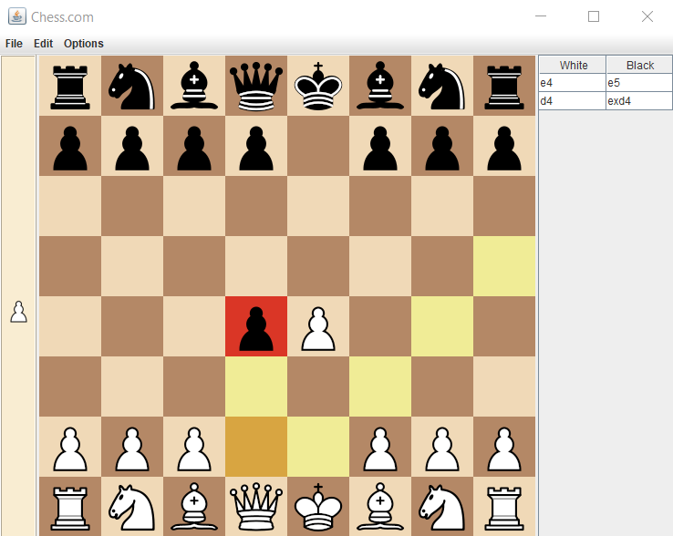

# Chess Game 

## Short description 

Chess is a game for two players. One player is having the white pieces and the other one, the black pieces. The goal is to capture the opponent’s king, known as checkmate. Chess is played on a board with 64 squares, each player having in the beginning 16 pieces: 8 pawns, two rooks, two knights, two bishops, one queen and one king. Those pieces are lined up in two rows. The player having the white pieces always starts first. Each piece can move on the board according to some specific rules.
Features of the application 

###	Pieces
•	a piece cannot be allowed to be placed in an incorrect square; 

•	the taken pieces will be displayed on the left bar;

•	whenever a piece is clicked, we should be able to see all the available moves; 

•	in the Preferences menu we can select with we want highlights or not;

•	when the pawn reaches the last row, it will get promoted to a queen;

###	Player

•	each player can make one move, then it’s the opponent’s turn; 

###	Board

•	we can also flip the board in Preferences menu;

###	Move

•	all the moves will be displayed in the right table;

•	once a move it’s make, it can be undo, from the Options Menu; 

•	we can also make the special moves like Castling or “En Passant” move;

###	Game

•	when it’s checkmate, the game stops and then display the winner; 

•	if it’s a draw, the game stops and then display draw; 

•	we can restart with a New Game from the Options menu;

•	we can exit the application by going to File -> Exit.

## Interface

